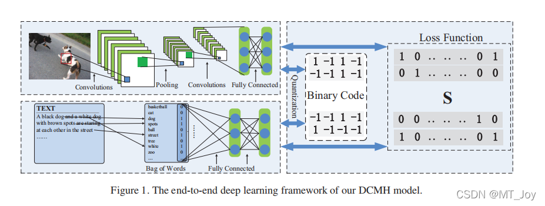
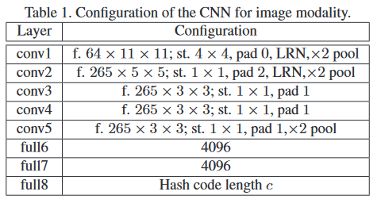
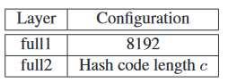
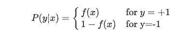
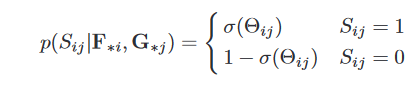

# Deep Cross-Modal Hashing
## Pre work
1. ANN(Approximate Nearest Neighbour)
   又名随机投影森林  
- 本质是寻找近邻样本
- ~~超平面上任选一种维度，按照该维度上的度量选取中点划分超平面，对每一个维度依次操作~~
> ### annoy算法
$\qquad$ 每次随机选取两个点用它们的中垂面划分高维空间，直到满足某种分割条件（例如每个子区域内部的点数都不超过k），建立起二叉树。在原始的数据集上随即建立起多颗类似的二叉树，需要寻找时，在每一个二叉树中都找到一定的范围取并集，最后选出TopK。
> ### LSH（局部敏感哈希）
$\qquad$在很多应用领域中，面对和需要处理的数据往往是海量并且具有很高的维度，怎样快速地从海量的高维数据集合中找到与某个数据最相似（距离最近）的一个数据或多个数据成为了一个难点和问题。如果是低维的小数据集，通过线性查找就可以容易解决，但如果是对一个海量的高维数据集采用线性查找匹配的话，会非常耗时，因此，为了解决该问题，我们需要采用一些类似索引的技术来加快查找过程，比如使用一个Hash函数将所有数据映射到一些哈希桶中。  
$\qquad$唯一的要求就是原本相邻的点经过哈希函数后仍然落在同一个哈希桶中。例如minihash：特征矩阵按行进行随机的排列后，第一列值为1的行的行号，假设有M条数据，随机排列N次，得到N*M的矩阵，对标记矩阵行进行分割，分割成若干个brand(一个brand若干行），则每个brand有N/B行。  
$\qquad$LSH的做法是在原来的高维空间中随机均匀的画很多个平面，具体有多少个可以用一个参数k来表示。高维空间中的每一点和这些平面就会有一个位置划分关系，比如点在平面上还是在平面下，分别对应1和0，这样每一个点就会形成一个长度为k的一个编码，被叫做汉明编码(hamingcode)，其实就是一串0,1组成的二进制编码。汉明距离被定义为：两个汉明编码中每一位有多少是不同的数量，它就是一个数字，代表这2个汉明编码有多少位是不同的。这样，原来高维空间中很接近的点，它们对应的汉明编码也应该大致相同，汉明距离就应该很小，完全相同则为0，因为它们如果在原来高维空间中很接近，则它们和这些平面的关系也很接近，对应的汉明编码也就很相似。如果把每一个汉明编码看作是一个桶，这样就相当于把原始高维空间中的相近的点以一个很大的概率都映射到了同一个桶里面了。这个概率具体有多大呢，这就和原始空间被划分的细致程度有关了，也就是平面的个数k，这个k越大，对应的所有可能的汉明编码数量也就是2k个，也就是桶的个数为2k个。  
## 网络结构及参数

## 哈希码学习方法
$\qquad$以$f(x_i;\theta_x) \in R^c$表示i号样本图像模态获得的特征向量；以$f(y_j;\theta_y) \in R^c$表示j号样本文字模态获得的特征向量，其中$\theta_x、\theta_y$为两个特征提取器的参数。则DCMH的目标函数可以表示为：
$$\underset{B^{(x)},B^{(y)},\theta_x,\theta_y}{min}\mathcal{J} = -\sum_{i,j=1}^{n}(S_{ij}\Theta_{ij}-log(1+e^{\Theta_{ij}})) + \gamma({||B^{(x)}-F||^2_F}+{||B^{(y)}-G||^2_F}) + \eta({||F1||^2_F}+{||G1||^2_F})$$
其中$F \in R^{c\times n}$且每一列均是一个样本得到的图像特征$F_{*i}=f(x_i;\theta_x)$，$G \in R^{c\times n}$且每一列均是一个样本得到的图像特征$G_{*j}=g(y_j;\theta_y)$，$\Theta_{ij}={1\over 2}F_{*i}^TG_{*j}$为两个维度特征向量内积组成的矩阵，$B^{(x)}_{*i}$是第i个样本的图像学习得到的哈希编码，
$B^{(y)}_{*j}$是第j个样本的文本学习得到的哈希编码，$S_{ij}$为相似矩阵（0-1）。  
$\qquad$分析这个目标函数，就需要说到负对数似然的问题，可以参考[这个链接](https://zhuanlan.zhihu.com/p/35709139)。在分析概率时，本质上，我们希望得到一个函数，它能告诉我们样本$x_i$属于+1的概率（或者属于-1的概率，本质上是一样的），定义$P(+1|x)=f(x)$，
  
那么，似然函数就会变成类似
$$L = f(x_1)(1-f(x_2)) ……f(x_n)$$ 
的形式，通常我们选取sigmoid函数作为这样的f，因为$1-\sigma(x) = \sigma(-x)$，此时再取对数就会变成$-log(1+e^{()})$的形式。 
$\qquad$那么对于DCMH目标函数中的第一项，它的本质是这样一个似然函数的负对数似然：
   
P.S.当$S_{ij}=1$时，$-log(\sigma(\Theta_{ij}))=-log({1\over {1+e^{-\Theta_{ij}}}})=-log({e^{\Theta_{ij}}\over {e^{\Theta_{ij}}+1} })=-(S_{ij}\Theta_{ij}-log(1+e^{\Theta_{ij}}))$  
$\qquad$那么，最小化这个负对数似然就相当于最大化上述似然函数，它意味着当$s_{ij}=1$时，$F_{*i}$和$G_{*j}$的相似度尽可能大。
$\qquad$而第二项，其最优化结果就是哈希码的取值为对应特征维度上特征值的符号，第三项则是为了在结果中哈希码的各位上-1和+1的数量较为相近，这样哈希码可以存储更多的信息（$F1$表示$F$中所有哈希码的每一位上求和得到的$c\times 1$的向量，+1和-1的数量越接近，$||F1||$的值越小）。  
$\qquad$在实验中作者发现把相同训练样本不同模态数据的哈希码设置为一样的时候能得到更好的效果，即$B^{(x)}=B^{(y)}=B$，
~~B = sign(F+G)~~，那么目标函数就变成：
$$\underset{B^{(x)},B^{(y)},\theta_x,\theta_y}{min}\mathcal{J} = -\sum_{i,j=1}^{n}(S_{ij}\Theta_{ij}-log(1+e^{\Theta_{ij}})) + \gamma({||B-F||^2_F}+{||B-G||^2_F}) + \eta({||F1||^2_F}+{||G1||^2_F})$$
$\qquad$但是如果一个样本是作为查询或者这个样本不是来自训练集里的时候，依然要对不同模态的数据生成不同的哈希码.

## 学习过程
作者采用一个替换的策略来学习参数。  
先固定$\theta_y、B$，学习$\theta_x$；然后固定$\theta_x、B$，学习$\theta_y$，再固定$\theta_x、\theta_y$，学习$B$，如此往复。

